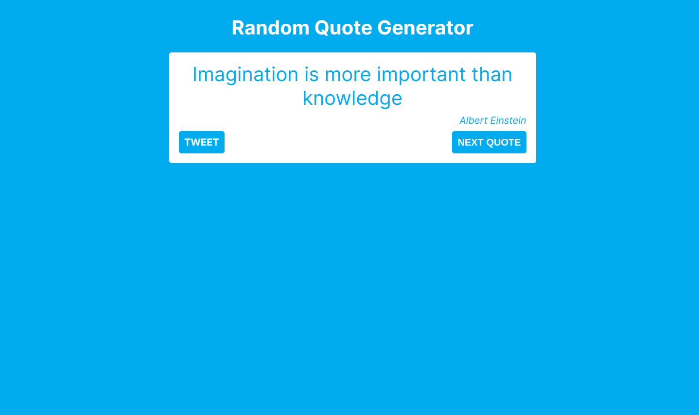

# Random Quote Generator
> Built in cljs (using shadow-cljs and reagent)



## Run

``` shell
yarn install

yarn watch
```

## Clean

``` shell
yarn clean
```

## Release

``` shell
yarn release
```

